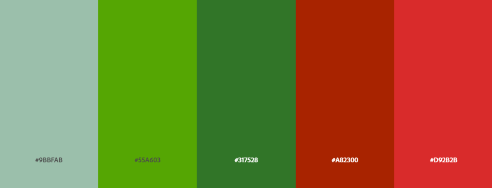

# Irish Wildlife MatchUp

[View live project here on Github]

Irish Wildlife MatchUp is a matching card game built with HTML, CSS and JavaScript. It is my first JavaScript project built for the Code Institute's Full Stack Software Development course.

 

![screenshot of webpage on various media devices]

---

## CONTENTS  
  
* [UXD (User Experience Design)](#user-experience-ux)
  * [User Stories](#user-stories) 
* [Creation process (Strategy -> Surface)](#creation-process)
  * [Wireframes](#wireframes)
* [Design](#design)
  * [Colour Scheme](#color-scheme)
  * [Light/Dark Theme](#lightdark-theme)
  * [Typography](#typography)
  * [Imagery](#imagery)
  * [Sounds](#sounds)
  * [Accessibility](#accessibility)
* [Page Features](#page-features)
* [Future Features](#future-features)
* [Technologies Used](#technologies-used)
  * [Languages Used](#languages-used)
  * [Frameworks, Libraries, Technologies & Programs Used](#frameworks-libraries-technologies--programs-used)
* [Deployment](#deployment)
  * [How to deploy](#how-to-deploy)
  * [How to clone](#how-to-clone)
  * [How to fork](#how-to-fork)
* [Testing](#testing)
* [Credits](#credits) 

---

## User Experience (UX)

### **User Stories**

### **Primary Goal**

Irish Wildlife MatchUp is an online memory card game styled with my own artwork of Irish flora and fauna. It is suitable for all ages with two gameboard sizes available. The game has a Light/Dark mode with the design changing to reflect this. Sounds of nature also play with an option for the user to mute the game.

### **Visitor Goals**

Irish Wildlife MatchUp has been designed to be eaily accessible and fun for all ages. It is a grid style card game that allows the user to flip two cards at a time in order to match them; testing their memory skills. The combination of artwork, music and nature sounds seek to bring the user into the wild environment as they play the game. Design and styling will be responsive to different media screen sizes and the user will have control over the aesthetic and the sounds played. A timer and moves counter will inform the user of their progress.

### **First Time Visitor**

  - A user can learn the game rules via a modal window.
  - A user can start the game via a start button.
  - A user can enter their name to personalise the game screen and record their score.
  - A user can decide which size gameboard they would prefer to play with, controlling the level of difficulty.
  - A user can toggle the display to Light/Dark mode.
  - A user can expect the timer and moves counter to start once they've click the first card.
  - A user receives visual and acoustic feedback from the cards if they match and if they don't.
  - A user can control the game sounds and music.
  - A user can click the cards to turn them over and play the game.
  - A user can see their progress via a timer and moves counter.
  - A user can reset the game via a reset button.
  - A user can see that the timer stops once they match the final cards.
  - A user can expect their scores to be displayed at the end via a modal window with an 'x' button in the corner to exit the window back to the gameboard.

### **Returning Visitor**

  - A user is familiar with the rules and can start the game via a start button.
  - A user can enter their name to be recorded on the gamescore board.
  - A user can set up their gamescreen using buttons for theme, gameboard size and audio playback.
  - A user can use the timer and moves counter to improve on their previous score and develop their memory skills.

### **Frequent Visitor**

  - A user can set out to beat their previous scores using the timer and moves counter.
  - A user can reset their game using the reset button if they do not acheive their desired score.
  - A user can visit the linked interactive page that features the animals from the game to learn more about them.

---

## Creation Process

### **1. Strategy**

The project goal was to build an interactive, memory game suitable for all ages. I wished to use my own artwork to personalise the styling of the game. The theme of the game is 'Irish Wildlife', with different animals displayed on the cards to be matched, and the game environment styled to reflect the Irish landscape.

  - The user will be able to familiarise themselves with the game rules before personalising the gameboard with visual and acoustic features. 
  - The user can develop their memory skills using the timer, moves counter and gamescore board which displays previous users' scores or play in a relaxed manner listening to the background nature soundtrack.

### **2. Scope**

The game must be responsive and playable on mobile, tablet and desktop sized devices. To assist with this, the styling and artwork will be clean, vectorised graphics that will adjust appropriately to the resizing of the screens.

  - The game will have two playable sizes; 4x4 and 6x4 grid layouts. The player can choose which size by clicking a button.
  - The game will have a light theme and a dark theme.
  - The game will play a soundtrack of forest sounds and offer feedback to the user with sound effects when buttons are selected and cards are flipped.
  - The game will track the time taken and moves made by the player.
  - The game will record the scores and names of players from previous plays.
  - A link will be displayed in the footer to an interactive page of the animals featured in the game for the player to learn more about them.

### **3. Structural**

Clear pathways to interactivity are essential for this games success. 

  - The player is informed of the rules via a modal window and a start button to bring them to the gameboard. This window also grants an option to enter the players name to record their scores, but this is optional.
  - Buttons and toggles along the perimeter of the gameboard give the player the options to control the visual and acoustic aspects of the game. Game size choice is also made available. 
  - The player is informed of their win, time taken and moves made by a modal window when the final cards are matched.
  - The layout and design of the gameboard changes very minimally between screen sizes to keep the experience consistent, and gameplay familiar.

### **4. Skeleton**

The game site will have a clean layout with every feature identifiable and interactive.

  - On loading, the game page will display a modal window front and centre for the user to immediately start the game (click the 'Start Game' button). This window will also offer an optional input section to enter the user's name. A 'tick' icon submits the name. An 'x' in the top, right corner exits the window.
  - The gameboard is situated in the center of the screen with the default size of 6x4 displayed.
  - A toggle button is displayed top right of the game screen to control the Light/Dark mode.
  - Volume controls are situated above the gameboard to the right.
  - Timer and moves counter are located above the gameboard to the left.
  - A reset button is located centered, below the cards on the gameboard.
  - The gameboard is centered over background art of an Irish landscape which changes to reflect the Light/Dark mode.
### Wireframes

### **5. Surface**

---

## Design

### **Colour Scheme**

Using the natural, vibrant colours present in the Irish landscape, I created a selection of colour palettes for the project using the Adobe Color program. 

_Main colour palette for the game_

The main palette will be used for the buttons, toggles and interactive elements of the gamepage.

 

_Colour palette for the gameboard_

The gameboard palette was inspired by natural wood tones and was used to give the gameboard design a 'heavy' feeling as it is the central, most important feature of the gamepage.

 

### **Light/Dark Theme**

I decided to include an option to switch between a light and dark theme to keep up with current webpage features. This will be accessed by a toggle switch at the top right of the page. The design of the background and the gameboard will change to reflect this.
.png)
_Light theme colours extracted from photography by Steven Hylands/Pexels_

 

.png)
_Dark theme colours extracted from photography by Matthew Ang/Pexels_

 

### **Typography**  

I chose the serif font 'Inknut Antiqua' from [Google Fonts](https://fonts.google.com/specimen/Inknut+Antiqua) and imported the Light 300 weight for use in my project. The font reminded me of the 'Book of Kells' in keeping with the Irish theme and is used throughout the project.

### **Imagery**

### **Sounds**

### **Accessibility**
  

Adobe Color Accessibility Tools used to check for colour blind safeness in main colour palette

Adobe Color Accessibility Tools used to check for colour blind safeness in gameboard colour palette

---

## Page Features

## Future Features

---

## Technologies Used

### **Languages Used**

- HTML5
- CSS3
- JavaScript

### **Frameworks, Libraries, Technologies & Programs Used** 

- Procreate - used to create wireframes and edit images 
- GitHub - used to save and store all files for this website  
- Git - used for version control
- Google Fonts - fonts were imported from here 
- Font Awesome - icons and their associated kit were downloaded from here  
- Adobe Color - for all color palettes and accessibility contrast ratios 
- Remove.bg - for image background removal 
- Favicon.io - for badger favicon  
- Tiny PNG - to compress images 
- Google Dev Tools - to debug and for testing responsiveness 
- Google Lighthouse - for auditing the website
- W3C Validator - for validating the HTML and CSS code 
- JSHint - for validating JavaScript

---

## Deployment

### **How to deploy**  

GitHub was used to deploy the website. These were the steps taken to acheive this:  

1. Login to GitHub account
2. Navigate to the project repository, irish-wildlife-matchup
3. Click the Settings button near the top of the page
4. In the left-hand menu, find and click on the Pages button
5. In the Source section, choose 'main' from the drop-down, select branch menu
6. Select 'root' from the drop-down folder menu
7. Click 'Save' and after a few moments the project will have been made live and a link is visible at the top of the page

---

## Testing

---

## Credits

### **Content References**

  - All content created is of my own design using copyright-free resources and is intended for educational purposes.
  - [Code Institute](https://codeinstitute.net/ie/) for their HTML/CSS/JavaScript learning material.
  - [W3Schools](https://www.w3schools.com/) for additional learning material.
  - [MDN Web Docs](https://developer.mozilla.org/en-US/docs/Web/JavaScript) for JavaScript best-practise, tutorials and guidance.

### **Media References**

  - [Pexels](https://www.pexels.com/), [Unsplash](https://unsplash.com/), and [Pixabay](https://pixabay.com/) for all reference material for creating the animals and background imagery.  
  - [Favicon](https://favicon.io/) for the favicon used for this site.
  

### **Acknowledgements**

