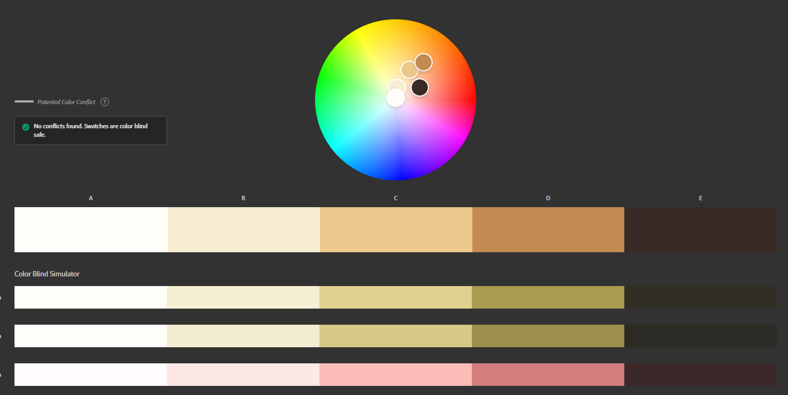

# Irish Wildlife MatchUp

[View live project here on Github]

Irish Wildlife MatchUp is a matching card game built with HTML, CSS and JavaScript. It is my first JavaScript project built for the Code Institute's Full Stack Software Development course.

 

![screenshot of webpage on various media devices]

---

## CONTENTS  
  
* [UXD (User Experience Design)](#user-experience-ux)
  * [User Stories](#user-stories) 
* [Creation process (Strategy -> Surface)](#creation-process)
  * [Wireframes](#wireframes)
* [Design](#design)
  * [Colour Scheme](#color-scheme)
  * [Light/Dark Theme](#lightdark-theme)
  * [Typography](#typography)
  * [Imagery](#imagery)
  * [Sounds](#sounds)
  * [Accessibility](#accessibility)
* [Page Features](#page-features)
* [Future Features](#future-features)
* [Technologies Used](#technologies-used)
  * [Languages Used](#languages-used)
  * [Frameworks, Libraries, Technologies & Programs Used](#frameworks-libraries-technologies--programs-used)
* [Deployment](#deployment)
  * [How to deploy](#how-to-deploy)
  * [How to clone](#how-to-clone)
  * [How to fork](#how-to-fork)
* [Testing](#testing)
* [Credits](#credits) 

---

## User Experience (UX)

### **User Stories**

### **Primary Goal**

Irish Wildlife MatchUp is an online memory card game styled with my own artwork of Irish animals. It is suitable for all ages. The game has a Light/Dark mode with the design changing to reflect this. An audio track of nature also plays with an option for the user to mute/unmute the sounds.

### **Visitor Goals**

Irish Wildlife MatchUp has been designed to be easily accessible and fun for all ages. It is a grid style card game that allows the user to flip two cards at a time in order to match them; testing their memory skills. The combination of artwork and nature sounds seek to bring the user into the wild environment as they play the game. Design and styling will be responsive to different media screen sizes and the user will have control over the aesthetic and the sounds played. A timer and moves counter will inform the user of their progress.

### **First Time Visitor**

  - A user can learn the game rules via a modal window.
  - A user can start the game via a start 'Tick' button.
  - A user can enter their name to personalise the game screen and record their score, this is optional.
  - A user can toggle the display to Light/Dark mode.
  - A user can expect the timer and moves counter to start once they've click the first card.
  - A user can control the game sounds.
  - A user can click the cards to turn them over and play the game.
  - A user can see their progress via a timer and moves counter.
  - A user can reset the game via a reset button.
  - A user can see that the timer stops once they match the final cards.
  - A user can expect their scores to be displayed at the end via a modal window.

### **Returning Visitor**

  - A user is familiar with the rules and can start the game via a start button.
  - A user can enter their name to be recorded on the gamescore board.
  - A user can set up their gamescreen using buttons for theme and audio playback.
  - A user can see their previous score displayed in the 'Recent Score' section when they choose to 'Play Again'. Seeing this score encourages the user to beat it on the next round.

### **Frequent Visitor**

  - A user can set out to beat their previous scores using the timer and moves counter and recent score display.
  - A user can reset their game using the reset button if they wish to change the name of the user.
 

---

## Creation Process

### **1. Strategy**

The project goal was to build an interactive, memory game suitable for all ages. I wished to use my own artwork to personalise the styling of the game. The theme of the game is 'Irish Wildlife', with different animals displayed on the cards to be matched, and the game environment styled to reflect the Irish landscape.

  - The user will be able to familiarise themselves with the game rules before personalising the gameboard with visual and acoustic features. 
  - The user can develop their memory skills using the timer, moves counter and gamescore board which displays the user's recent score or play in a relaxed manner listening to the background nature soundtrack.

### **2. Scope**

The game must be responsive and playable on mobile, tablet and desktop sized devices. To assist with this, the styling and artwork will be clean, vectorised graphics that will adjust appropriately to the resizing of the screens.

  - The game will allow the user to personalise their board with their name.
  - The game will have a light theme and a dark theme.
  - The game will play a soundtrack of forest sounds.
  - The game will track the time taken and moves made by the player.
  - The game will record the score for the player from the previous play.
  - The game will have two playable sizes; 4x3 and 6x4 grid layouts. The player can choose which size by clicking a button.*

  * Producing artwork for the 6x4 board was at this time not possible due to time restraints, however the larger gameboard will be added in the future with a wider variety of animals displayed on the cards. I wish to have the cards shuffle through all of the available artwork, no matter the gameboard size, so that the user can challenge their skills.

### **3. Structural**

Clear pathways to interactivity are essential for this games success. 

  - The player is informed of the rules via a modal window and a start 'Tick' button to bring them to the gameboard. This window also presents an input section to enter the players name to record their recent score, but this is optional.
  - Buttons and toggles along the perimeter of the gameboard give the player the options to control the visual and acoustic aspects of the game. (Game size choice will be made available in future versions.)
  - The player is informed of their win, time taken and moves made by modal window when the final cards are matched. This modal is personalised with the user's name if they choose to enter it in the 'start' modal.
  - The layout and design of the gameboard changes very minimally between screen sizes to keep the experience consistent, and gameplay familiar.

### **4. Skeleton**

The game site will have a clean layout with every feature identifiable and interactive.

  - On loading, the game page will display a modal window front and centre for the user to immediately start the game (click the 'Tick' button). This window will also offer an optional input section to enter the user's name. The 'Tick' button submits the name. 
  - The gameboard is situated in the center of the screen with the size of 4x3 gamecards displayed.
  - A theme toggle button is displayed top right of the game screen to control the Light/Dark mode.
  - An audio control is situated beside the theme toggle to unmute/mute the nature sounds.
  - Timer and moves counter are located above the gameboard to the left for larger screens and on top for smaller screens.
  - A reset button is located centered, below the cards on the gameboard.
  - The gameboard is centered over background art of an Irish landscape which changes to reflect the Light/Dark mode.
### Wireframes

Wireframe - Desktop main window

Wireframe - Desktop Start modal window

Wireframe - Desktop Win modal window

Wireframe - Desktop Gameboard

Wireframe - Mobile main window

Wireframe - Mobile Start window

Wireframe - Mobile Win window

  

   

### **5. Surface**

---

## Design

### **Colour Scheme**

Using the Adobe Color website, I used the colour picker to select colours from landscape photographs and created palettes from these to create the themed backgrounds. Shades of brown were used to create the gameboard palette. These colours are used throught the gameboard and buttons/toggles, and in both of the Light/Dark Themes.

_Colour palette for the gameboard_

The gameboard palette was inspired by natural wood tones and was used to give the gameboard design a 'heavy' feeling as it is the central, most important feature of the gamepage.

 

### **Light/Dark Theme**

I decided to include an option to switch between a light and dark theme to keep up with current webpage features. This will be accessed by a toggle switch at the top right of the page. The design of the background and the gameboard will change to reflect this.
.png)
_Light theme colours extracted from photography by Steven Hylands/Pexels_

 

.png)
_Dark theme colours extracted from photography by Matthew Ang/Pexels_

 

### **Typography**  

I chose the serif font 'Inknut Antiqua' from [Google Fonts](https://fonts.google.com/specimen/Inknut+Antiqua) and imported the Light 300 weight for use in my project. The font reminded me of the 'Book of Kells' in keeping with the Irish theme and is used throughout the project.

### **Imagery**

I wished to create the artwork for the game, instead of using photographs, to give the game a more 'playful' feeling. I gathered a selection of copyright free images as my reference material and used colours picked from the images to create the artwork in Procreate.

### **Sounds**

### **Accessibility**
  

Adobe Color Accessibility Tools used to check for colour blind safeness in main colour palette

Adobe Color Accessibility Tools used to check for colour blind safeness in gameboard colour palette

---

## Page Features

## Future Features

---

## Technologies Used

### **Languages Used**

- HTML5
- CSS3
- JavaScript

### **Frameworks, Libraries, Technologies & Programs Used** 

- Procreate - used to create the animal artwork and edit images
- Figma - used to produce wireframes and background vector artwork 
- GitHub - used to save and store all files for this website  
- Git - used for version control
- Google Fonts - fonts were imported from here 
- Font Awesome - icons and their associated kit were downloaded from here  
- Adobe Color - for all color palettes and accessibility contrast ratios 
- Remove.bg - for image background removal 
- Simple Image Resizer - to resize all artwork
- Convertio - to convert PNG files to WEBP files
- Favicon.io - for badger favicon  
- Tiny PNG - to compress images 
- Online Audio Convertor - to compress mp3 files
- Google Dev Tools - to debug and for testing responsiveness 
- Google Lighthouse - for auditing the website
- W3C Validator - for validating the HTML and CSS code 
- JSHint - for validating JavaScript

---

## Deployment

### **How to deploy**  

GitHub was used to deploy the website. These were the steps taken to acheive this:  

1. Login to GitHub account
2. Navigate to the project repository, irish-wildlife-matchup
3. Click the Settings button near the top of the page
4. In the left-hand menu, find and click on the Pages button
5. In the Source section, choose 'main' from the drop-down, select branch menu
6. Select 'root' from the drop-down folder menu
7. Click 'Save' and after a few moments the project will have been made live and a link is visible at the top of the page

---

## Testing

---

## Credits

### **Content References**

  - All content created is of my own design using copyright-free resources and is intended for educational purposes.
  - [Code Institute](https://codeinstitute.net/ie/) for their HTML/CSS/JavaScript learning material.
  - [W3Schools](https://www.w3schools.com/) for additional learning material.
  - [MDN Web Docs](https://developer.mozilla.org/en-US/docs/Web/JavaScript) for JavaScript best-practise, tutorials and guidance.

### **Media References**

  - [Pexels](https://www.pexels.com/), [Unsplash](https://unsplash.com/), and [Pixabay](https://pixabay.com/) for all reference material for creating the animals and background imagery.  
  - [Favicon](https://favicon.io/) for the favicon used for this site.
  

### **Acknowledgements**

