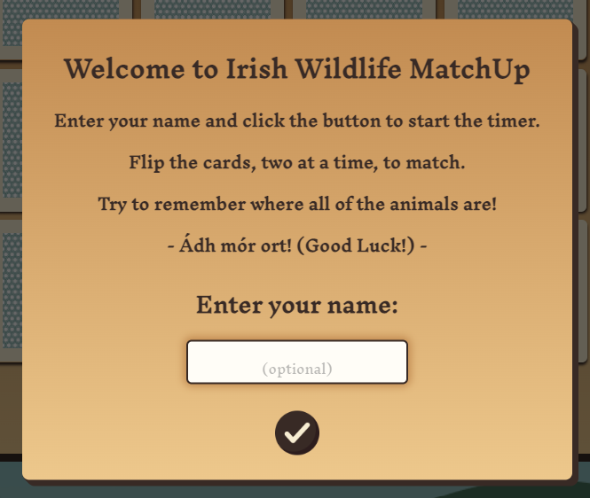
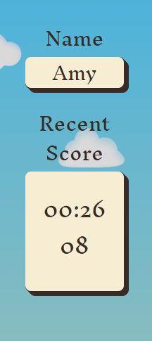
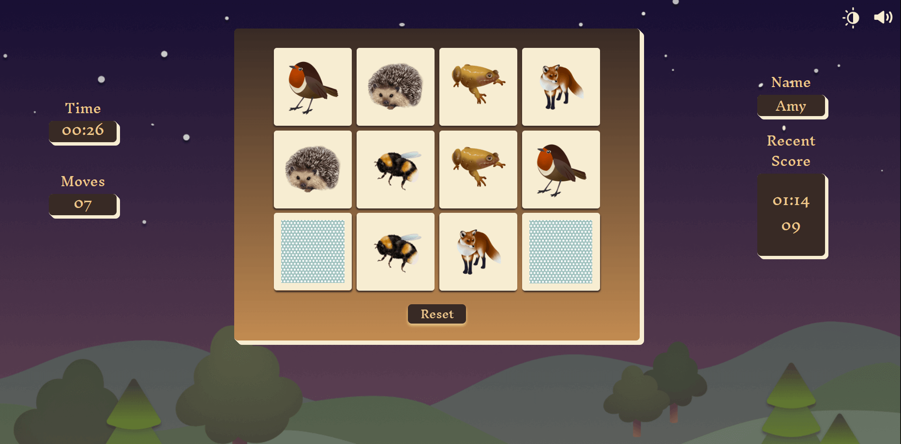
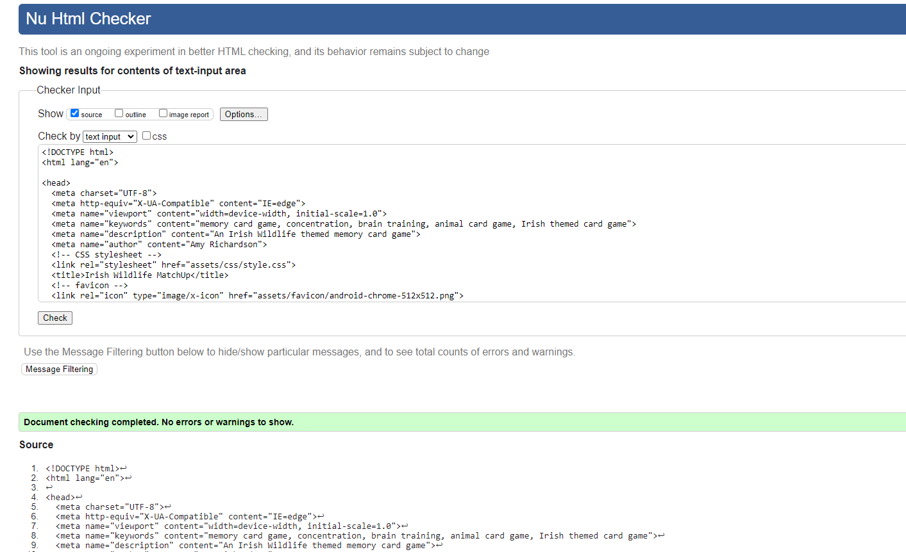
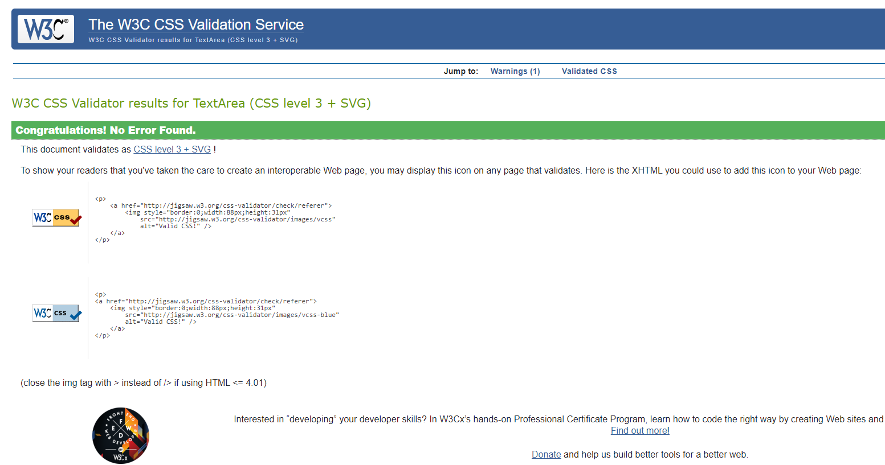
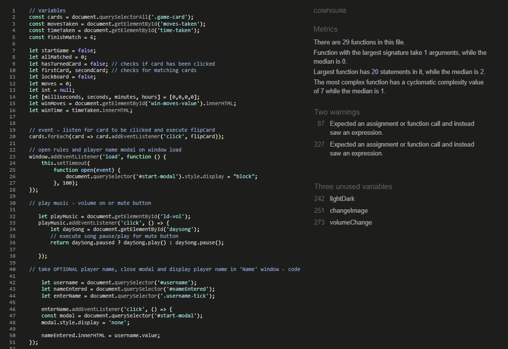
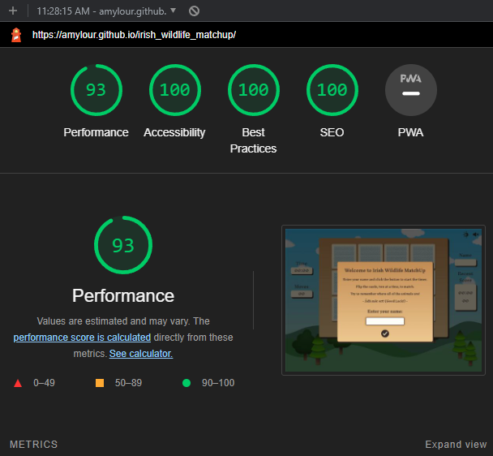
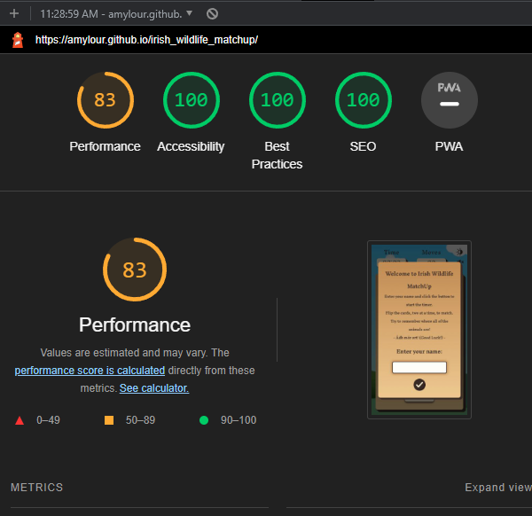
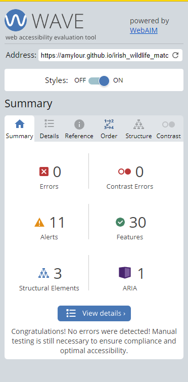

# Irish Wildlife MatchUp

[View live project here on Github](https://amylour.github.io/irish_wildlife_matchup/)

Irish Wildlife MatchUp is a matching card game built with HTML, CSS and JavaScript. The aim of the game is enjoy the matching experience in a non-competitive, relaxed environment where the visual and audio aspects have been thoughtfully designed to reflect the theme. It is my first JavaScript project built for the Code Institute's Full Stack Software Development course.

 

---

## CONTENTS  
  
* [UXD (User Experience Design)](#user-experience-ux)
  * [User Stories](#user-stories) 
* [Creation process (Strategy -> Surface)](#creation-process)
  * [Wireframes](#wireframes)
* [Design](#design)
  * [Colour Scheme](#color-scheme)
  * [Light/Dark Theme](#lightdark-theme)
  * [Typography](#typography)
  * [Imagery](#imagery)
  * [Sounds](#sounds)
  * [Accessibility](#accessibility)
* [Page Features](#page-features)
* [Future Features](#future-features)
* [Technologies Used](#technologies-used)
  * [Languages Used](#languages-used)
  * [Technologies & Programs Used](#technologies--programs-used)
* [Deployment](#deployment)
  * [How to deploy](#how-to-deploy)
  * [How to clone](#how-to-clone)
  * [How to fork](#how-to-fork)
* [Testing](#testing)
* [Credits](#credits) 

---
 

## User Experience (UX)

### **User Stories**

### **Primary Goal**

Irish Wildlife MatchUp is an online memory card game styled with my own artwork of Irish animals. It is suitable for all ages. The game has a Light/Dark mode with the design changing to reflect this. An audio track of nature also plays with an option for the user to mute/unmute the sounds.

### **Visitor Goals**

Irish Wildlife MatchUp has been designed to be easily accessible and fun for all ages. It is a grid style card game that allows the user to flip two cards at a time in order to match them; testing their memory skills. The combination of artwork and nature sounds seek to bring the user into the wild environment as they play the game. Design and styling will be responsive to different media screen sizes and the user will have control over the aesthetic and the sounds played. A timer and moves counter will inform the user of their progress.

### **First Time Visitor**

  - As a first time user, I want to know the rules of the game.
  - As a first time user, I want to choose when to start the game.
  - As a first time user, I want to have the choice of a Light/Dark mode.
  - As a first time user, I want to control any audio playing.
  - As a first time user, I want a visually pleasing experience.
  - As a first time user, I want a friendly, challenging play experience.
  - As a first time user, I want my progress to be recorded.
  - As a first time user, I want to be able to play against my previous score.
  - As a first time user, I want positive feedback when I complete the game.

### **Returning Visitor**

  - As a returning user, I want to be able to personalise my gameboard.
  - As a returning user, I want to be able to configure my gamescreen and experience.
  - As a returning visitor, I want to be able to reset the gamescreen quickly if I share it with another user for their try.
  - As a returning visitor, I want to be able to play the game on different devices.
  
---
 

## Creation Process

### **1. Strategy**

The project goal was to build an interactive, memory game suitable for all ages. I wished to use my own artwork to personalise the styling of the game. The theme of the game is 'Irish Wildlife', with different animals displayed on the cards to be matched, and the game environment styled to reflect the Irish landscape.

  - The user will be able to familiarise themselves with the game rules before personalising the gameboard with visual and acoustic features. 
  - The user can develop their memory skills using the timer, moves counter and gamescore board which displays the user's recent score or play in a relaxed manner listening to the background nature soundtrack.

### **2. Scope**

The game must be responsive and playable on mobile, tablet and desktop sized devices. To assist with this, the styling and artwork will be clean, vectorised graphics that will adjust appropriately to the resizing of the screens.

  - The game will allow the user to personalise their board with their name.
  - The game will have a light theme and a dark theme.
  - The game will play a soundtrack of forest sounds.
  - The game will track the time taken and moves made by the player.
  - The game will record the score for the player from the previous play.
  - The game will have two playable sizes; 4x3 and 6x4 grid layouts. The player can choose which size by clicking a button.*

  * Producing artwork for the 6x4 board was at this time not possible due to time restraints, however the larger gameboard will be added in the future with a wider variety of animals displayed on the cards. I wish to have the cards shuffle through all of the available artwork, no matter the gameboard size, so that the user can challenge their skills.

### **3. Structural**

Clear pathways to interactivity are essential for this games success. 

  - The player is informed of the rules via a modal window and a start 'Tick' button to bring them to the gameboard. This window also presents an input section to enter the players name to record their recent score, but this is optional.
  - Buttons and toggles along the perimeter of the gameboard give the player the options to control the visual and acoustic aspects of the game. (Game size choice will be made available in future versions.)
  - The player is informed of their win, time taken and moves made by modal window when the final cards are matched. This modal is personalised with the user's name if they choose to enter it in the 'start' modal.
  - The layout and design of the gameboard changes very minimally between screen sizes to keep the experience consistent, and gameplay familiar.

### **4. Skeleton**

The game site will have a clean layout with every feature identifiable and interactive.

  - On loading, the game page will display a modal window front and centre for the user to immediately start the game (click the 'Tick' button). This window will also offer an optional input section to enter the user's name. The 'Tick' button submits the name. 
  - The gameboard is situated in the center of the screen with the size of 4x3 gamecards displayed.
  - A theme toggle button is displayed top right of the game screen to control the Light/Dark mode.
  - An audio control is situated beside the theme toggle to unmute/mute the nature sounds.
  - Timer and moves counter are located above the gameboard to the left for larger screens and on top for smaller screens.
  - A reset button is located centered, below the cards on the gameboard.
  - The gameboard is centered over background art of an Irish landscape which changes to reflect the Light/Dark mode.
### Wireframes

Wireframe - Desktop main window

Wireframe - Desktop Start modal window

Wireframe - Desktop Win modal window

Wireframe - Desktop Gameboard

Wireframe - Mobile main window

Wireframe - Mobile Start window

Wireframe - Mobile Win window

  
   

### **5. Surface**

---

## Design

### **Colour Scheme**

Using the Adobe Color website, I used the colour picker to select colours from landscape photographs and created palettes from these to create the themed backgrounds. Shades of brown were used to create the gameboard palette. These colours are used throught the gameboard and buttons/toggles, and in both of the Light/Dark Themes.

_Colour palette for the gameboard_

The gameboard palette was inspired by natural wood tones and was used to give the gameboard design a 'heavy' feeling as it is the central, most important feature of the gamepage.

 

### **Light/Dark Theme**

I decided to include an option to switch between a light and dark theme to keep up with current webpage features. This will be accessed by a toggle switch at the top right of the page. The design of the background and the gameboard will change to reflect this.
.png)
_Light theme colours extracted from photography by Steven Hylands/Pexels_

 

.png)
_Dark theme colours extracted from photography by Matthew Ang/Pexels_

 

### **Typography**  

I chose the serif font 'Inknut Antiqua' from [Google Fonts](https://fonts.google.com/specimen/Inknut+Antiqua) and imported the Light 300 weight for use in my project. The font reminded me of the 'Book of Kells' in keeping with the Irish theme and is used throughout the project.

### **Imagery**

I wished to create the artwork for the game, instead of using photographs, to give the game a more 'playful' feeling. I gathered a selection of copyright free images as my reference material and used colours picked from the images to create the artwork in Procreate.

 

### **Sounds**

Once the main gameboard has been accessed, by pressing the start 'Tick' button, the forest soundtrack will start playing. The soundtrack is muted and the volume button must be selected for the user to hear the nature sounds. Birds can be heard chirping, leaves rustling in the wind and a stream can be heard babbling.

I considered the use of additional audio feedback with card flip sounds and 'pings' to indicate successful cards matches, however I felt it did not fit with the relaxed game environment that I was seeking.

[Pixabay Sound Effects](https://pixabay.com/sound-effects/forest-with-small-river-birds-and-nature-field-recording-6735/)
 

### **Accessibility**

Adobe Color Accessibility Tools used to check for colour blind safeness in gameboard colour palette

---

## Page Features

### **1. Start Modal** 
  

The start modal greets the user when the page first loads. It details the rules and offers the option to enter a player name to personalise the gameboard. This is indicated with the 'optional' placeholder. Pressing the 'Tick' button starts the game.

 
  
### **2. Game Board**
  

The gameboard offered is a 4x3 grid style gameboard. A hexagonal pattern decorates the backs of the cards to reflect traditional playing card graphics. are flipped, two at a time, revealing artwork created by myself. Matched cards stay facing up. Unmatched cards flip back over and increase the 'Moves' counter by one. A 'Reset' button is present which will reset the game experience for the current player or to set it up for a new player.

 
  
### **3. Timer & Moves Counter**
  

The timer starts when the first card is clicked and works as a stopwatch recording the time taken, instead of counting down from a set time. This is to allow the player to choose whether they wish to play a relaxed game or to try to beat their recent score. A moves counter increases every time two cards, which don't match, are selected.
  
### **4. Player Name & Recent Score**
  

The optional player name input from the start modal displays the entered name above the score section. The recent score displayed is the winning time and moves count from the player's last round when they choose to continue playing. This score can be some visual encouragement for the player to beat. 
  
### **5. Theme & Volume Toggles**
  

The player has the option to turn on the volume for the nature soundtrack that plays when the game loads, they can then also mute it. The player also has the option to choose a dark theme over the default light theme for a different play experience.
  
### **6. Win Modal**
  

The win modal displays the player's name if they chosen to enter it initially. It also displays the winning time and moves count for the player to see. Pressing the 'Play Again?' button allows the player to continue the same game experience with a shuffled gameboard, reset timer and moves counter and their previous score displayed in the 'Recent Score' section.

### **7. Dark Theme**
  

The dark theme is accessed via a theme toggle located at the top, right hand corner of the screen. It changes the default day theme to a night-time background, with darker gameboard, timer, moves counter, name and score area. The theme and volume toggles change colour also to standout against the background. Both the day and night themed backgrounds were created by myself in Figma.

 

## Future Features

- As mentioned earlier in the README, I had wished to include the option for a larger 6x4 gameboard. Creation of more artwork was beyond the scope for this version, but will be included in the next one.
- In addition, the next version will allow for the complete array of animal artwork to be shuffled and used, no matter the size of the gameboard. The selection of cards will be greater and present fresh boards to encourage the user to continue playing and practising their memory skills.
- I would like to include a high score board with all of the player's names entered and their top scores so that players can compete against others.
---
 

## Technologies Used

### **Languages Used**

- HTML5
- CSS3
- JavaScript

### **Technologies & Programs Used** 

- Procreate - used to create the animal artwork and edit images
- Figma - used to produce wireframes and background vector artwork 
- GitHub - used to save and store all files for this website  
- Git - used for version control
- Google Fonts - fonts were imported from here 
- Font Awesome - icons and their associated kit were downloaded from here  
- Adobe Color - for all color palettes and accessibility contrast ratios 
- Remove.bg - for image background removal 
- Simple Image Resizer - to resize all artwork
- Convertio - to convert PNG files to WEBP files
- Favicon.io - for badger favicon  
- Tiny PNG - to compress images 
- Online Audio Convertor - to compress mp3 files
- Google Dev Tools - to debug and for testing responsiveness 
- Google Lighthouse - for auditing the website
- W3C Validator - for validating the HTML and CSS code 
- JSHint - for validating JavaScript

---

## Deployment

### **How to deploy**  

GitHub was used to deploy the website. These were the steps taken to acheive this:  

1. Login to GitHub account.
2. Navigate to the project repository, irish-wildlife-matchup.
3. Click the Settings button near the top of the page.
4. In the left-hand menu, find and click on the Pages button.
5. In the Source section, choose 'main' from the drop-down, select branch menu.
6. Select 'root' from the drop-down folder menu.
7. Click 'Save' and after a few moments the project will have been made live and a link is visible at the top of the page.

 

### **How to run this project locally**  

To clone this project from GitHub:  

1. Visit the [Irish Wildlife MatchUp repository](https://github.com/amylour/irish_wildlife_matchup).
2. Click on the <b>Code</b> dropdown menu located beside the green <b>GitPod</b> button. 
3. Choosing your preferred cloning option of <b>HTTPS, SSH</b> or <b>GitHub CLI</b>, click on the clipboard icon to copy the displayed URL. 
4. Open the terminla in your code editor and change the working directory to the location that you wish to use for the cloned directory.
5. Type 'git clone' into the terminal, paste your copied link and press enter.

   

### **To fork the repository on GitHub** 
  
To make a copy of this GitHub repository that allows you to view the content and make changes without affecting the original repository, please take the following steps:
  
1. Login to <b>GitHub</b> and find [this repository](https://github.com/amylour/irish_wildlife_matchup).
2. Locate the <b>Fork</b> button in the top, right hand side of the page.
3. Click on the <b>Fork</b> button to create a copy of the repository in your GitHub account.

   

---

## Testing
  
### **Initial testing plan**  
  
The primary goal with this project was to create a visually pleasing, responsive web application that delivers a positive experience for the user. I have used Chrome Dev Tools to thoroughly test my game through all stages. Using the console to debug my JavaScript was a new experience and skill which will continue to be developed on. I deployed my page early on in the build to ensure that I could test on real world devices. These devices included:
  
- Acer Aspire 3 Laptop (1920 X 1080)  
- Huawei AD80HW 24" Monitor
- iPad Pro 2021
- iPhone SE(2016) 
- iPhone 13
- Samsung Galaxy s10
- Oppo Reno 8 Lite

On desktop, the browsers that I had access to for testing were:

- Chrome
- Firefox 
- Edge  
  
On my iPad Pro I had access to Safari but not the Safari Dev Tools/Web Inspector. This would have been helpful to solve an ongoing bug with the start modal's height appearing clipped near the bottom, interrupting the user's ability to enter their name. This is detailed more in the Bugs section.

The results of feature testing in <b>Chrome</b>, <b>Firefox</b>, <b>Edge</b> and <b>Safarai</b> are as follows:

| Feature | Test | Chrome(Windows) | Firefox(Windows) | Edge(Windows) | Chrome(Android) | Safari (iPadOS) |
|----|---------|----|----|----|----|----| 
| Start Modal | Modal appears on main window load, centered with opaque background | Pass | Pass | Pass | Pass | Fail(Bug no.) |
| Start Modal | Input field allows input | Pass | Pass | Pass | Pass | Pass (*Bug no.) |
| Start Modal Tick Button | Removes modal from view and places player name in Name section when clicked/touched | Pass | Pass | Pass | Pass | Pass |
| Light/Dark Theme toggle | Toggle changes game design themes on click/touch | Pass | Pass | Pass | Pass | Pass |
| Volume/Mute toggle | Sound is muted when window loads and is audible when volume is unmuted | Pass | Pass | Pass | Pass | Pass |
| Gameboard | Cards are responsive and flip when clicked/touched | Pass | Pass | Pass | Pass | Pass |
| Gameboard | Only two cards are responsivenes to click/touch at a time | Pass | Pass | Pass | Pass | Pass |
| Gameboard | Cards flip back over when not matched | Pass | Pass | Pass | Pass | Pass |
| Gameboard | Cards that match stay facing up | Pass | Pass | Pass | Pass | Pass |
| Timer | Timer starts when first card is clicked/touched | Pass | Pass | Pass | Pass | Pass |
| Timer | Timer stops when all cards are matched | Pass | Pass | Pass | Pass | Pass |
| Moves counter | Moves counter increases by one when two non-matching cards are clicked/touched | Pass | Pass | Pass | Pass | Pass |
| Win Modal | Modal appears centered with opaque background | Pass | Pass | Pass | Pass | Pass |
| Win Modal | Modal win message personalised with entered players name from Start modal | Pass | Pass | Pass | Pass | Pass |
| Win Modal | Modal shows winning time and moves counter value | Pass | Pass | Pass | Pass | Pass |
| Win Modal Tick Button | Removes modal from view, resets timer/moves counter, flips over and shuffles cards, keeps player name in name section, winning time/moves displayed in Recent Score section, player theme/audio preferences retained from current session, when clicked/touched | Pass | Pass | Pass | Pass | Pass |
| Reset Button | Resets entire gameboard to fresh, loaded state with no player personalisation | Pass | Pass | Pass | Pass | Pass |  
  
   
  
### **Bugs Section** 

  
 
| No. | Bug | Feature | Status | Fix |
|----|-----|---------|--------|-----|
| 1. |time incorrectly displayed | Timer | | 
| 2. | Previously matched cards not resetting correctly for next session | Gameboard | Resolved | |
| 3. |card flip sound sporadic | Gameboard | Feature removed | Card flip noise detracted from peaceful feeling of the game |
| 4. | 'Start' button (now 'Reset') text jumping to the side when clicked | Reset button | Resolved | Added margin-left to fix bug of button text jumping to right when clicked - help source - https://stackoverflow.com/a/26908722 |
| 5. | Shuffling issue revealing matched cards in next game session | Gameboard | Resolved | I found that due to my shuffle function being inside an IIFE (https://www.tutorialsteacher.com/javascript/immediately-invoked-function-expression-iife), my 'reset game' function set up was behaving incorrectly when called in a new game session. I added a hard reset function with a basic windows reload but I felt this narrowed the scope of my project. I continued developing my game and resolved the issue in a new reset function by removing the shuffle function from the IIFE and placing it directly into my new resetGame() function. This was the best that I could do within my scope of JavaScript study. I used the above link with [MDN](https://developer.mozilla.org/en-US/docs/Glossary/IIFE) documents to help me to solve this issue. |
| 6. | Themed audio | Light/Dark theme | Resolved | Initially, I had considered having a night time audio track playing when the user switches to dark theme. I had a few options of audio tracks but similar to the 'card flip' sound, I found the change to be quite jarring in relation to the intended 'relaxed' aesthetic of the game. In addiion to this I found it difficult to create the JavaScript needed, after many different attempts, to allow the tracks to be swapped whilst still maintaining the function of the mute audio button. This is something that I will develop for the next version of the game and as the scope of my JavaScript learning grows. |
| 7. | Play Again button responds to second click only | Win Modal | Resolved | 'onClick' placed in wrong HTML element and playAgain function updated to be called on first click by adding an EventListener to 'win-button' ID and adding the playAgain() function to it outside of the original function.
| 8. | Audio not playing onload | Audio | Resolved | I added an if/else statement to audio play function to control when the music is muted/playing. |
| 9. | Start Modal will appear again if user rapidly clicks on 'Tick' button when window first loads | Start modal | Resolved | Reduced setTimeout for window EventListener |
| 10. | Start Modal and name input field cut off on display and when typing name | Start Modal | <b>Safari only</b> - Current | I have troubleshooted this issue to no avail. I have set a specific height, I have increased the input field size, reduced font size and investigated the 'border-box' properties for iOS. [Stack Overflow](https://stackoverflow.com/questions/42775664/pop-up-modal-being-cut-off-at-top-of-page) provided some suggestions which I have investigated. The issue does not present itself when viewing the webpage in Chrome Dev Tools. I would wish to access a Mac to use Web Inspector to debug this issue. |

  

### **Validation**
  
The [W3C Validator](https://validator.w3.org/) was used to validate HTML and the CSS file was validated in the [Jigsaw W3C validator](https://jigsaw.w3.org/css-validator/). [JSHint](https://jshint.com/) was used to validate the JavaScript file. Below are the records of these validations:  
  

W3C HTML Validation - no errors or warnings to show 

W3C Jigsaw CSS Validation - no errors found

JSHint for JavaScript validation

Lighthouse Scores for Desktop

Lighthouse Scores for Mobile

WAVE report for accessibility

    

---

## Credits

### **Content References**

  - All content created is of my own design using copyright-free resources and is intended for educational purposes.
  - [Free Code Camp](https://tinyurl.com/mpfnzhbt) for their Memory Card Game tutorial which I have practised, understood and adapted to fit my game.
  - [Code Institute](https://codeinstitute.net/ie/) for their HTML/CSS/JavaScript learning material.
  - [W3Schools](https://www.w3schools.com/) for additional learning material:
      - Modal how to -  https://www.w3schools.com/howto/howto_css_modals.asp
  - [MDN Web Docs](https://developer.mozilla.org/en-US/docs/Web/JavaScript) for JavaScript best-practise, tutorials and guidance.
  - [Stack Overflow](https://stackoverflow.com/) for assistance:
      - Add '0' to minutes/seconds in timer - https://stackoverflow.com/questions/26898378/javascript-countdown-timer-need-a-second-digit 
      - Centering modals - https://stackoverflow.com/questions/39627549/how-to-center-modal-to-the-center-of-screen
      - Fix text jumping when button clicked - https://stackoverflow.com/a/26908722
  - [Web Designer Hut](https://webdesignerhut.com/3d-buttons-with-css-dropshadow/) for solid drop shadow tutorial.
  - [Keith Paterson Youtube](https://www.youtube.com/watch?v=KB6Yg5hNrqc) for modal user input and response assistance.
  - [Foolish Developer](https://foolishdeveloper.com/create-a-simple-stopwatch-using-javascript-tutorial-code/) for help in creating a timer function.
  - [Eyehunts.com](https://tutorial.eyehunts.com/js/swap-images-in-javascript-simple-onclick-image-swap-example/) for swapping images using JavaScript.

 

### **Media References**

  - [Pexels](https://www.pexels.com/), [Unsplash](https://unsplash.com/), and [Pixabay](https://pixabay.com/) for all reference material for creating the animals and background imagery: 
    - Red fox (credit: Adam Sondel)
    - Frog (credit: Inspired Images)
    - Robin (credit: Hans)
    - Falcon (credit: Iulian Ursache)
    - Hedgehog (credit: Amaya Eguizába)
    - Bee (credit: Myriams-Fotos)
  - [Pattern Monster](https://pattern.monster/hexagon-2/) for hexagonal pattern on back of cards.
  - [Favicon](https://favicon.io/) for the favicon used for this site.
  - [Freepik](https://www.freepik.com/) for the volume icon (credit: Amazona Adorada), theme toggle (credit: Saepul Nahwan) and tick button (credit: Vectors Market).
  - [Pixabay](https://pixabay.com/) for the forest soundtrack (credit: Garuda1982).

  

### **Acknowledgements**

